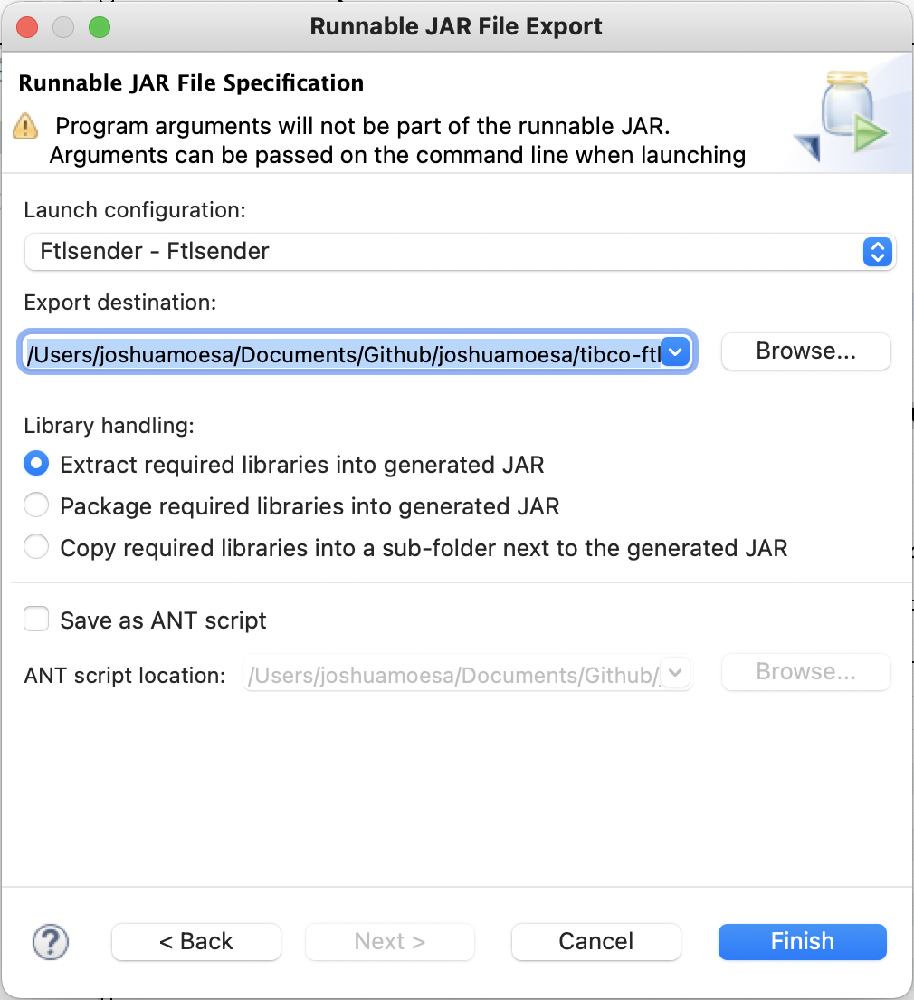

# tibco-ftlloadtester

Java programs to test the performance of TIBCO FTL server. Original code: [https://gitlab.com/jbrandsma/ftlloadtester](https://gitlab.com/jbrandsma/ftlloadtester)

For your convenience, an Eclipse workspace can be found under /src/

## Preparation

### Creating Runnable JARS in Eclipse

Make sure that whilst creating runnable jars using Eclipse (_right-click project > Export > Runnable JAR file_), at _Library handling_ option 'Extract required libraries into generated JAR.' is chosen. 



### Run programs on macOS Big Sur

#### Set correct PATH variable

Make sure that the bin folder of your FTL environment is included in the PATH variable:

```export PATH=$PATH:/opt/tibco/ftl/6.6/bin```

### Set programs in samples directory of FTL environment

Make sure that you've placed the runnable jars in /opt/tibco/ftml/6.6/samples

### Run the setup script first before you run a program

CD to /opt/tibco/ftml/6.6/samples and run the setup script:

```. ./setup```

### Include the java.library.path in the run command

The programs need some (dynamic) libraries to run properly or else you will encounter error messages like "Exception in thread "Thread-0" java.lang.UnsatisfiedLinkError: no tibftljni in java.library.path: [/opt/tibco/ftl/6.6/bin]"
To fix this, include a java.library.path environment variable in the run command:

```java -Djava.library.path="/opt/tibco/ftl/6.6/lib" -jar Ftlsender.jar -R 'localhost:8585' -e tibsend-endpoint -a tibsend```

#### Run multiple instances

It is possible to run multiple instances of both the sender as well as the receiver. Nevertheless make sure to always:
* Use separate statistics output files (-F switch)
* Use a unique instance Name (-i switch).

## Ftlsender program

Produces load on FTL. Basic command to start the program:

```java -Djava.library.path="/opt/tibco/ftl/6.6/lib" -jar Ftlsender.jar -R 'localhost:8585' -e tibsend-endpoint -a tibsend```

The following switches can be used:

-i ==> instance name. This name is used to identify this instance in the log file. Default =
instance1.

-R ==> realm host. By default http://localhost:8080 is used. Examle -R http//realm.org:8080

-e ==> endpoint name.

-a ==> application name.

-Smin ==> minimal message size (in bytes). Default = 100.

-Smax ==> maximum message size (in bytes). Default = 100.

-n ==> message name. Default = testMessage.

-h ==> nr of hits per second per thread. Default = 10.

-d ==> duration in minutes. Default = 1

-T ==> number of threads. Default = 1

-F ==> log file path and name. Default is not to use a file.

-u ==> username. Default is empty.

-p ==> password. Default is empty.

The ftlsender logs statistics to the console every 10 seconds. Apart from that a comma delimited output file with the statistics is generated if the -F switch s used.
The following data is provided:
* instanceName
* threadID
* duration (in seconds)
* TOTAL number of hits since the start of the receiver

## Ftlreceiver program

The ftlreciever is used to receive messages created with the sender.

The application be started with the following command:

```java -Djava.library.path="/opt/tibco/ftl/6.6/lib" -jar Ftlreceiver.jar -R 'localhost:8585' -e tibsend-endpoint -a tibsend```

The application takes the following options:

-i ==> instance name. This name is used to identify this instance in the log file. Default =
instance1.

-R ==> realm host. By default http://localhost:8080 is used. Examle -R http//realm.org:8080

-e ==> endpoint name.

-a ==> application name.

-d ==> durable name.

-F ==> log file path and name. Default is not to use a file.

-u ==> username. Default is empty.

-p ==> password. Default is empty.

The ftlreceiver logs statistics to the console every 10 seconds. Apart from that a comma delimited output file with the statistics is generated if the -F switch s used.
The following data is provided:
* instanceName,
* duration (in seconds)
* TOTAL number of hits since the start of the receiver

## References

* Original source code [https://gitlab.com/jbrandsma/ftlloadtester](https://gitlab.com/jbrandsma/ftlloadtester)
* TIBCommunity - How can I resolve an FTL UnsatisfiedLinkeError for tibftljni.dll? [https://community.tibco.com/questions/how-can-i-resolve-ftl-unsatisfiedlinkeerror-tibftljnidll](https://community.tibco.com/questions/how-can-i-resolve-ftl-unsatisfiedlinkeerror-tibftljnidll)